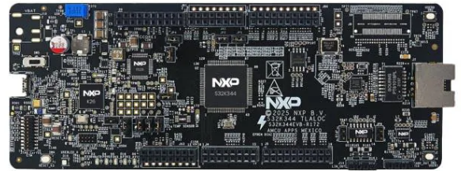

# NXP Application Code Hub

## Motion and Temperature Sensing using LPI2C and GPIO on FRDM-Auto-S32K344 with MCAL Drivers
This demo shows how to configure and use the LPI2C and GPIO drivers from the Real-Time Drivers (RTD / MCAL) package on the FRDM S32K344 Evaluation Board using S32 Design Studio.
The example demonstrates motion and temperature monitoring using I2C sensor communication and RGB LED control via GPIO.

#### Boards: FRDM S32K344 
#### Categories: Communication
#### Peripherals: FLEXIO
#### Toolchains: S32 Design Studio IDE

## Table of Contents
1. [Software](#step1)
2. [Hardware](#step2)
3. [Setup](#step3)
4. [Results](#step4)
5. [Support](#step6)
6. [Release Notes](#step7)

## 1. Software
- [S32 Design Studio IDE v3.6.5 or later](https://www.nxp.com/design/design-center/software/automotive-software-and-tools/s32-design-studio-ide/s32-design-studio-for-s32-platform:S32DS-S32PLATFORM)
- [S32K3_S32M27x Real-Time Drivers ASR R23-11 Version 7.0.0](https://www.nxp.com/design/design-center/software/automotive-software-and-tools/real-time-drivers-rtd:AUTOMOTIVE-RTD)

## 2. Hardware
### 2.1 Required Hardware
- Personal Computer
- 12V Power Adapter
- S32 Debugger (PEmicro)
- Type-C USB cable
- [FRDM S32K344](https://www.nxp.com/design/design-center/development-boards-and-designs/S32K344MINI-EVB)[

](./images/S32K344MINI-EVB.png)

### 2.3 Debugger Connection
- Connect the PEmicro debugger to the Cortex Debug connector
- Connect debugger USB to PC
- Power the board using the 12V adapter

## 3. Setup

### 3.1 Import the Project into S32 Design Studio IDE
1. Open S32 Design Studio IDE, in the Dashboard Panel, choose **Import project from Application Code Hub**.
[

](./images/import_project_1.png)

2. You can find the demo you need by searching for the name directly. Open the project, click the **GitHub link**, S32 Design Studio IDE will automatically retrieve project attributes then click **Next>**.
[

](./images/import_project_2.png) 
[

](./images/import_project_3.png)

3. Select **main** branch and then click **Next>**.
[

](./images/import_project_4.png)

4. Select your local path for the repo in **Destination->Directory** window. The S32 Design Studio IDE will clone the repo into this path, click **Next>**.
[

](./images/import_project_5.png)

5. Select **Import existing Eclipse projects** then click **Next>**.
[

](./images/import_project_6.png)

6. Select the project in this repo (only one project in this repo) then click **Finish**.
[

](./images/import_project_7.png)

### 3.2 Generating, Building and Running the Example
1. In Project Explorer, right-click the project and select **Update Code and Build Project**. This will generate the configuration (Pins, Clocks, Peripherals), update the source code and build the project using the active configuration (e.g. Debug_FLASH).
Make sure the build completes successfully and the *.elf file is generated without errors.
[

](./images/update_and_build.png)
Press **Yes** in the **SDK Component Management** pop-up window to continue.

2. Go to **Debug** and select **Debug Configurations**. There will be a debug configuration for this project:
[

](./images/Debug_config.png)

        Configuration Name                  Description
        -------------------------------     -----------------------
        $(example)_debug_flash_pemicro      Debug the FLASH configuration using PEmicro probe

    Select the desired debug configuration and click on **Debug**. Now the perspective will change to the **Debug Perspective**.
    Use the controls to control the program flow.

## 4. Results
After flashing and running the application on the FRDM S32K344:
- The system continuously monitors temperature and acceleration data over LPI2C.
- If temperature exceeds 37°C:
    - The RGB LED flashes white.
    - Temperature alert overrides any motion indication.
- If a shake event is detected:
    - The RGB LED performs a triple-flash animation.
    - A cooldown period prevents repeated triggering.
- Board orientation is displayed using LED color coding:
    - Positive X axis → Green
    - Negative X axis → Cyan
    - Positive Y axis → Red
    - Negative Y axis → Yellow
    - Positive Z axis → Blue
    - Negative Z axis → Magenta

## 5. Support
For general technical questions related to NXP microcontrollers, please use the *NXP Community Forum*.
#### Project Metadata

<!----- Boards ----->

<!----- Peripherals ----->

<!----- Toolchains ----->

Questions regarding the content/correctness of this example can be entered as Issues within this GitHub repository.

>**Warning**: For more general technical questions regarding NXP Microcontrollers and the difference in expected functionality, enter your questions on the [NXP Community Forum](https://community.nxp.com/)

## 6. Release Notes
| Version | Description / Update                           | Date                        |
|:-------:|------------------------------------------------|----------------------------:|
| 1.0     | Initial release on Application Code Hub        |February 17th 2026|